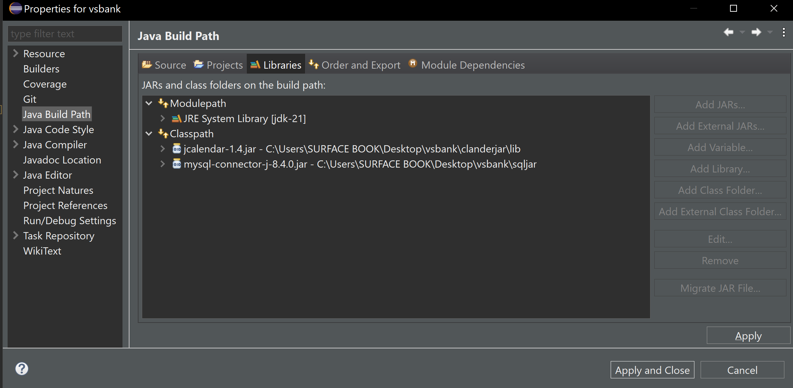

# Projet de système bancaire - Projet Java Swing

## Description
Le système bancaire est une application Java Swing qui simule les opérations bancaires de base. Il offre une interface conviviale pour gérer les comptes, les transactions et autres fonctions bancaires essentielles.

## Fonctionnalités
- Connexion en tant qu'administrateur ou client
- Inscription de nouveaux clients
- Transactions de dépôt et de retrait
- afficher du Blance
- Historique des transactions
- modifier les informations du compte
- supprimer un compte
- Interface utilisateur conviviale pour l'administrateur/client avec Java Swing et AWT
- Base de données MYSQL

## Images

## Pour commencer
Tout d'abord, vous devez créer les bases de données :

## Base de données

create database banque;
use banque;

create table Clients(
id int auto_increment primary key,
nom varchar(50),
prenom varchar(50),
tel varchar(50) ,
email varchar(50),
adress varchar(50),
gender varchar(50),
date_naissance varchar(50) NULL,
pass varchar(50)
);

create table ClientAcc (
Acc_num varchar(50) primary key unique,
client_id int,
balance int,
foreign key (client_id) references Clients(id)
);

create table transfert(
id int auto_increment primary key,
trans_id varchar(50),
fromWho varchar(50),
toWho varchar(50),
date_trans timestamp,
montant int
);

create table admin (
id int auto_increment primary key,
user_name varchar(50),
pass varchar(50),
tel int
);

insert into admin(user_name,pass,tel) values
("admin1","1234",27000032),
("admin2","1212",27000033);

## Connexion à la base de données
C'est localement :
- Adresse : localhost
- Port : 3306
- User : root
- Mot de passe : (vide)
- Nom de la base de données : banque

## Chemin vers le fichier SQLJAR
Ajoutez de nouveaux fichiers JAR externes sur le chemin de classe à partir de eclipse docier :
proprietie > java build path > Libaries > classpath > add external jars.

Vous pouvez obtenir les fichiers jar sut la fichier vsbank dans les chemins suivants:
vsbank\clanderjar\lib\jcalendar-1.4.jar
vsbank\sqljar\mysql-connector-j-8.4.0.jar

## Exécuter l'application
Vous pouvez exécuter l'application sur la classe ApplicationRun.java dans le defaultpakage.

## Compte administrateur
Nous avons inséré deux comptes d'administrateur dans la base de données :
- admin1 avec le mot de passe 1234
- et
- admin2 avec le mot de passe 1212

Vous pouvez vous connecter en tant qu'administrateur avec ces deux comptes. Il vous suffit de saisir "admin1" dans le champ "numéro de téléphone" et le mot de passe dans le champ "mot de passe".

## Compte client
Pour vous inscrire en tant que client, veuillez remplir le formulaire d'inscription. Une fois inscrit, vous pourrez vous connecter en tant que client en utilisant votre numéro de téléphone et votre mot de passe.

## Erreur
Pour toutes les erreurs, nous avons créé des JOptionPane pour vous informer.

